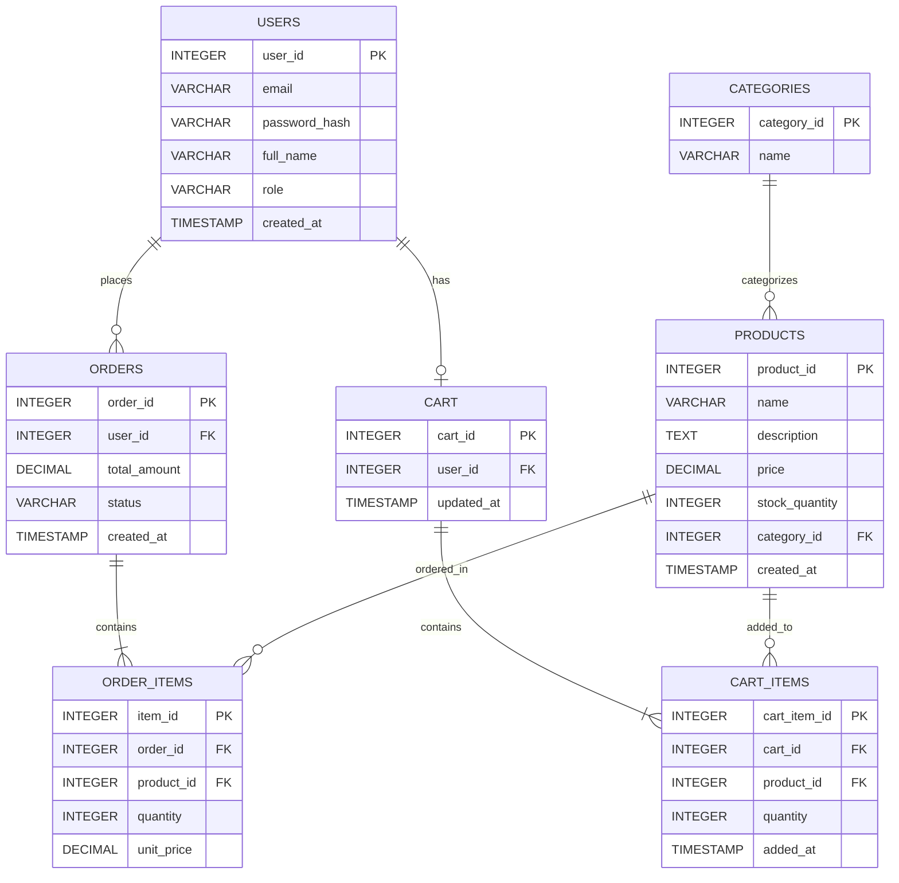

# Sprint 1: System Architecture and Scope

Project: TechBazar – online store for consumer electronics
Repository: Ecommerce--2K23-CSM-61-
Branch: main

## 1. Target Audience and Market Focus

### Primary Persona

The main users of TechBazar will be university students and young working people between 18 and 30 years of age. These users buy mobile phones, laptops, headphones and accessories, but they do not like visiting physical markets again and again. They usually check prices on their phone before making any purchase decision. "most Pakistani customers prefer cash on delivery, so COD can be a later feature".

### Core Pain Point

When these customers buy from local electronics markets, prices are not transparent and the same product has different rates at different shops. Stock information is also unavailable before visiting the shop, so a customer may travel for nothing. There is no place where they can compare specs, see the price clearly, and keep a record of their previous orders. TechBazar is planned to solve exactly this problem with a simple online catalog, fixed prices and proper order history.

### Domain Scope

The platform will serve the consumer electronics vertical only. In the first version we will deal with mobile accessories, laptops, and audio products. Other categories like home appliances are out of scope for now.

## 2. MVP Feature Scope

I have kept the MVP small on purpose because this project has to be completed within one semester along with other courses. Only the workflows without which an online store cannot function are included.

| Category | Feature Name | Description | Priority |
|---|---|---|---|
| Authentication | Signup and Login | User can create an account and log in. Passwords are stored hashed and sessions are handled with JWT tokens. | High (MVP) |
| Catalog | Product listing and search | A products page where users can search by name and filter by category. | High (MVP) |
| Cart | Cart management | User can add items, change quantity and remove items. The cart stays saved even after logging out. | High (MVP) |
| Checkout | Order placement | Cart is converted into an order. Payment will be mock in the beginning, Stripe test mode can be connected later. | High (MVP) |
| Admin | Product management | Admin can add, edit and delete products and update stock quantities. | Medium |

Things like wishlist, reviews, recommendations and courier tracking are deliberately left out of the MVP so the scope stays achievable.

## 3. Tech Stack and Justification

### Frontend: React

I chose React because I have already worked with it in a course project, so I will not waste weeks learning a new framework. Its component model fits this project well since product cards, cart widget and forms can all be separate reusable components. Compared to Angular, React felt lighter and easier to debug for a single-developer project.

### Backend: Node.js with Express

Express is selected because it is simple to set up and the same JavaScript language can be used on both frontend and backend, which saves effort for one person working alone. It handles REST API routes like /products, /cart and /orders without much boilerplate. I compared it with Django, but Django's learning curve and Python setup did not justify the extra effort for this scope.

### Database: PostgreSQL

The data in this project is strongly relational: orders refer to users, order items refer to products, and stock must update correctly when an order is placed. PostgreSQL gives proper foreign keys and transactions, which protects against cases like an order being saved but its items failing. MongoDB was considered but keeping order and inventory consistency manually in a document database would create extra work.

### Caching: Redis (optional)

If time remains after the core features, Redis can store logged-in sessions and hot product lists to reduce repeated database hits. This is marked optional because the MVP will work fine without it on a small user base.

## 4. Entity-Relationship Diagram

The schema below is written in Mermaid so it renders directly on GitHub. Money values use DECIMAL so rounding errors do not occur, and order items store their own unit_price so that later price changes do not alter old orders.

### Relationships in words

- One user places many orders (1:N)
- One user has one active cart (1:1)
- One category contains many products (1:N)
- One order contains many order items (1:N)
- One product appears in many order items (1:N)
- One cart contains many cart items (1:N)
- One product appears in many cart items (1:N)

Orders and Products have a many-to-many relationship in reality, which is broken into two 1:N relationships through the Order_Items table. The same pattern is used between Cart and Products through Cart_Items.
