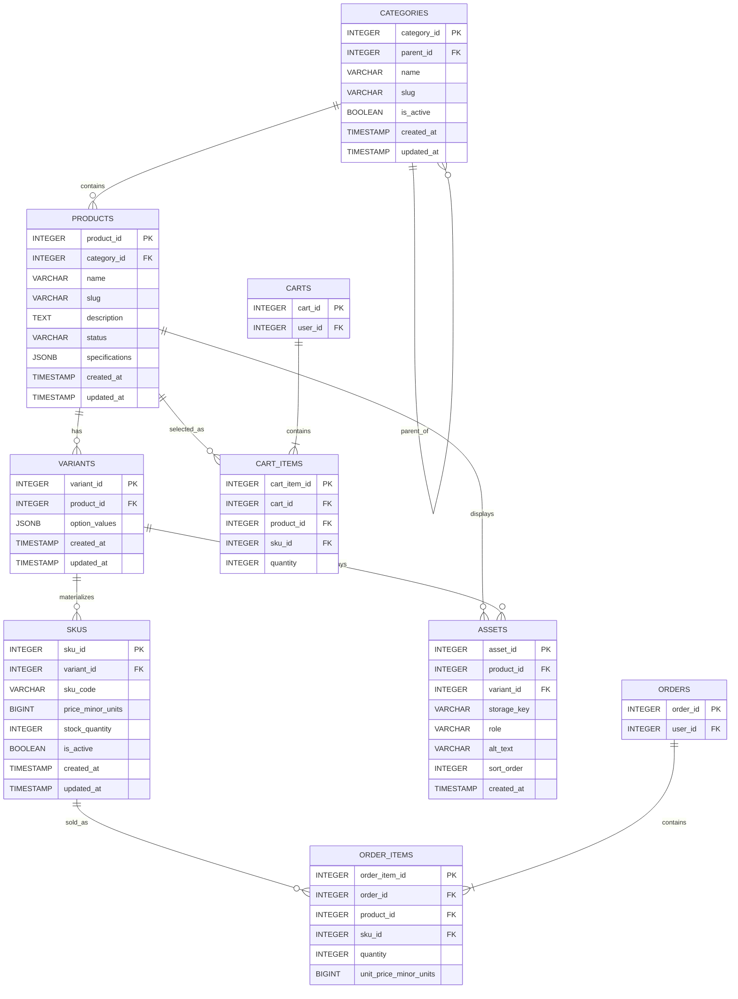

# Sprint 2: Catalog Data Foundation

**Project:** TechBazar – Online Store for Consumer Electronics
**Repository:** Ecommerce--2K23-CSM-61-
**Branch:** main
**Deadline:** 2nd October 2026

## 1. Sprint goal and scope boundary

Given a product catalog administrator, the system persists categories, products, variants, and SKUs without losing identity, relationship, price, or inventory meaning.

**In scope:** category tree with stable identifiers and slugs; product creation and editing with status and description; variants and SKUs with unique codes, price, stock, and availability; authenticated administration; database constraints, migrations, seed data, and focused tests.

**Out of scope (Sprint 3+):** dynamic specification UI, asset upload, public catalog search, publication workflows, payment gateway, order placement, shipping, and full shopper checkout. These are stubbed only and are not claimed as Sprint 2 functionality.

## 2. Sprint 1 decisions reused or changed

See `docs/SPRINT_1.md`. **Reused:** React frontend, Node.js + Express backend, PostgreSQL, JWT authentication, relational modeling, and the electronics-only MVP boundary.

**Changed / extended:**
- Sprint 1 stored price and stock directly on PRODUCTS. Sprint 2 moves sellable price and stock to SKUS so every variant combination keeps its own identity, price, and stock.
- New entities: VARIANTS, SKUS, ASSETS. Specifications are stored as validated JSONB on PRODUCTS.
- The Sprint 1 ERD is extended, not replaced. Carts, Cart_Items, Orders, and Order_Items keep their Sprint 1 meaning and gain a planned `sku_id` link in Sprint 3.

## 3. Updated ERD and data dictionary



`CART_ITEMS.sku_id` and `ORDER_ITEMS.sku_id` are planned Sprint 3 foreign keys; until then those tables keep their Sprint 1 `product_id` links.

### Data dictionary

| Entity | Key columns | Meaning |
|---|---|---|
| CATEGORIES | category_id PK, parent_id FK, name, slug UNIQUE, is_active | Category tree; a category can never become its own ancestor |
| PRODUCTS | product_id PK, category_id FK, name, slug UNIQUE, description, status, specifications JSONB | Catalog item; status = draft / published / archived |
| VARIANTS | variant_id PK, product_id FK, option_values JSONB | One valid option combination, e.g. `{"color":"Silver","storage":"512GB"}` |
| SKUS | sku_id PK, variant_id FK, sku_code UNIQUE, price_minor_units, stock_quantity, is_active | The sellable unit with its own price and stock |
| ASSETS | asset_id PK, product_id FK, variant_id FK, storage_key, role, alt_text, sort_order | Image/manual placeholder (upload is Sprint 3) |

## 4. Administration route table with examples

Implemented in `backend/server.js`. Every route requires `Authorization: Bearer <admin JWT>`; missing or invalid token returns **401**, a valid token without admin role returns **403**.

| Method | Route | Purpose |
|---|---|---|
| POST | /api/v1/admin/categories | Create category |
| GET | /api/v1/admin/categories | Return category list/tree |
| POST | /api/v1/admin/products | Create draft product |
| GET | /api/v1/admin/products | Return administrative product records |
| PATCH | /api/v1/admin/products/:id | Update product content or status |
| POST | /api/v1/admin/products/:id/skus | Add validated SKU (creates the variant if missing) |
| PATCH | /api/v1/admin/skus/:id | Update price, stock, or active status |

Errors are JSON with an `error` key. Auth errors carry a machine-readable code; duplicate slugs/SKUs return a clear **409** client error, never a server traceback.

### Example: create category (201)

```http
POST /api/v1/admin/categories
Authorization: Bearer [REDACTED]

{ "name": "Laptops", "slug": "laptops", "parent_id": 1, "is_active": true }
```

```json
{ "category_id": 2, "name": "Laptops", "slug": "laptops", "parent_id": 1, "is_active": true }
```

### Example: duplicate slug (409)

```json
{ "error": "Duplicate slug" }
```

### Example: add SKU (201)

```http
POST /api/v1/admin/products/1/skus
Authorization: Bearer [REDACTED]

{ "variant_options": { "color": "Silver", "storage": "512GB" },
  "sku_code": "AERO14-SLV-512", "price_minor_units": 9499900,
  "stock_quantity": 10, "is_active": true }
```

```json
{ "sku_id": 2, "variant_id": 2, "sku_code": "AERO14-SLV-512",
  "price_minor_units": 9499900, "stock_quantity": 10, "is_active": true }
```

### Example: update SKU stock (200)

```http
PATCH /api/v1/admin/skus/2
Authorization: Bearer [REDACTED]

{ "stock_quantity": 8 }
```

### Example: no token (401)

```json
{ "error": { "code": "UNAUTHENTICATED", "message": "Token is required" } }
```

## 5. Data integrity and authorization decisions

**Money:** stored as integer minor units (`price_minor_units` BIGINT, paisa). Rs 9,499.00 = `9499900`. Floating-point money is not used anywhere.

**Database-enforced rules (CAT-05):** migration `migrations/002_catalog_foundation.sql` adds `UNIQUE (slug)` on categories and products, `UNIQUE (sku_code)` on SKUs, `CHECK (stock_quantity >= 0)`, `CHECK (price_minor_units >= 0)`, `CHECK (status IN ('draft','published','archived'))`, `CHECK (jsonb_typeof(specifications) = 'object')`, and a trigger `trg_category_cycle` that raises an error if a category would become its own ancestor. API validation alone is not relied upon.

**Foreign key policies:**

| Relationship | Policy | Reason |
|---|---|---|
| CATEGORIES.parent_id → CATEGORIES | ON UPDATE CASCADE, ON DELETE RESTRICT | A parent with children cannot be deleted by accident |
| PRODUCTS.category_id → CATEGORIES | ON UPDATE CASCADE, ON DELETE RESTRICT | Products keep a stable canonical category |
| VARIANTS.product_id → PRODUCTS | ON UPDATE CASCADE, ON DELETE RESTRICT | Protects variant/SKU identity |
| SKUS.variant_id → VARIANTS | ON UPDATE CASCADE, ON DELETE RESTRICT | Protects sellable identity and history |
| ASSETS.product_id / variant_id | ON UPDATE CASCADE, ON DELETE CASCADE | Assets belong to their owner |

**Specification validation rule:** `specifications` must be a top-level JSON object; values must be strings, numbers, booleans, or arrays of scalars; nested objects are rejected by API validation and the JSONB check constraint.

**Authorization (CAT-06):** all `/api/v1/admin` routes pass through a JWT middleware; writes and reads both require `role = admin`.

### Business rules and edge cases

1. **Draft without SKU?** Yes — a draft is not sellable yet. **Published without sellable SKU?** No — Sprint 3 publication rules must block public display when no active SKU exists.
2. **One canonical category** per product (`PRODUCTS.category_id`): simple tree, clear breadcrumb, no duplicate placement. A join table can be added later without breaking this.
3. **Parent deactivated:** children stay in the database and admin tree, but the whole subtree is treated as unavailable publicly until moved to an active parent.
4. **Out-of-stock SKU:** stays `is_active = true` with `stock_quantity = 0`, represented as `availability: OUT_OF_STOCK`, not purchasable.
5. **Two SKUs sharing a price:** allowed. **Price override:** the SKU owns its price in Sprint 2; promotional overrides are a Sprint 3 concern.
6. **Negative stock / duplicate SKU codes:** prevented by `CHECK (stock_quantity >= 0)` and `UNIQUE (sku_code)` at the database level, plus API validation.
7. **Deactivated product referenced by future cart/order:** never hard-deleted; it is archived or its SKU deactivated. Historical order items keep the SKU reference; checkout validates active/sellable status.

## 6. Seed data and demonstration

Reproducible seed: `seeds/02_catalog_seed.sql`, run after the migration:

```bash
createdb techbazar
psql -d techbazar -f migrations/002_catalog_foundation.sql
psql -d techbazar -f seeds/02_catalog_seed.sql
```

Seed contents: category tree `Electronics → Laptops / Audio / Mobile Accessories` (two levels); products `AeroBook 14` (4 variants), `SoundCore Mini`, `PowerCase 5000`; six valid SKUs (`AERO14-SLV-256`, `AERO14-SLV-512`, `AERO14-BLK-256`, `AERO14-BLK-512`, `SOUNDCORE-BLK`, `POWERCASE-5000`). The combination **AeroBook 14 Black / 1TB is intentionally unavailable** and is simply absent — not stored as a fake zero-stock SKU (CAT-04).

Demonstration (administrator flow, tokens redacted): create category → create product → add SKU → retrieve records:

```http
POST /api/v1/admin/categories      → 201 (example above)
POST /api/v1/admin/products        → 201 { "product_id": 1, "slug": "aerobook-14", "status": "draft" }
POST /api/v1/admin/products/1/skus → 201 (example above)
GET  /api/v1/admin/products        → 200 products with nested variants and SKUs
```

## 7. Test strategy, command, and result

Automated tests live in `backend/tests/admin.test.js` (Node built-in `node:test`, no external dependencies). They cover success and rejection paths for authorization, required fields, duplicate slug, duplicate SKU, stock rules, category cycle prevention, and variant combination rules.

Command:

```bash
node --test backend/tests/admin.test.js
```

Result:

```text
✔ CAT-06: admin role is allowed
✔ CAT-06: non-admin is rejected
✔ CAT-02: product creation accepts required fields
✔ CAT-02: product creation rejects missing slug
✔ CAT-02: duplicate slug is rejected
✔ CAT-03: SKU creation accepts required fields
✔ CAT-03: SKU creation rejects missing sku_code
✔ CAT-03: duplicate SKU code is rejected
✔ CAT-05: negative stock is rejected
✔ CAT-05: zero stock is allowed (out-of-stock representation)
✔ CAT-01: category cycle is prevented
✔ CAT-01: valid category chain is accepted
✔ CAT-04: existing variant combination is found
✔ CAT-04: missing combination is absent, not a fake zero-stock SKU
14 passing tests
```

Database-level rules (unique slug/SKU, non-negative stock, cycle trigger) are additionally enforced by constraints in `migrations/002_catalog_foundation.sql`.

## 8. Known limitations and Sprint 3 backlog

**Limitations:** no public catalog reads yet; asset upload not implemented (schema only); specifications validation is basic; publication is a status field without workflow; cart/checkout not yet SKU-aware.

**Sprint 3 backlog (builds on this foundation, no duplicated pricing logic):** dynamic specifications, asset upload, public catalog reads, publication rules, catalog-to-cart readiness with `sku_id` on Cart_Items and Order_Items, search and category browsing.
